# 第一章——逻辑和证明

## 1.1 命题逻辑

### 1.1.3条件语句

## 1.3 命题等价式

### 1.3.4 证明逻辑等价

#### 化简法

#### 真值表法

### 1.3.5 命题的可满足性

## 1.4 谓词和量词

### 1.4.7 涉及量词的逻辑等价式

> 把全称量词改为存在量词，析取改为合取，同样成立

### 1.4.8 量化表达式的否定

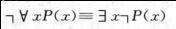

## 1.6 推理规则

### 1.6.3 命题逻辑的推理规则

### 1.6.4 使用推理规则建立论证

### 1.6.5 消解律

### 1.6.6 谬误

# 第二章——基本结构

## 2.1 集合

### 2.1.1 引言

### 2.1.4 集合的大小

### 2.1.5 幂集

### 2.1.6 笛卡尔积

### 2.1.7 使用带量词的集合符号

### 2.1.8 真值集和量词

## 2.2 集合的运算

### 2.2.2 集合恒等式

#### 证明方法

- 成员表

  

- 定律

  

## 2.5 集合的基数

### 2.5.1引言

### 2.5.2 可数集

#### 可数集合

- 所有整数集合
- 正有理数集合

#### 不可数集合

- 实数集合

#### 有关基数的结果

## 2.6 矩阵

### 2.6.1 引言

> 矩阵下标从1开始

### 2.6.2 矩阵算数

#### 加法

#### 乘积

### 2.6.3 矩阵的转置和幂

#### 单位矩阵

#### 矩阵的转置

#### 对称矩阵

### 2.6.4 0-1矩阵

> 所有元素非0即1的矩阵称为0-1矩阵

#### 0-1矩阵的并和交

#### 布尔积

#### 布尔幂

# 第三章——计数

## 3.2 鸽巢原理

### 3.2.1 鸽巢原理

### 3.2.2 广义鸽巢原理

### 3.2.3鸽巢原理的应用

## 3.3 排列与组合

### 3.3.2 排列

> 即$p(n, r) = A_n^r$

### 3.3.3 组合

> 即$C(n, r) = C_n^r$

## 3.4 二项式系数和恒等式

### 3.4.1 二项式定理

> $(_n^m) = C_m^n$

### 3.4.2 帕斯卡恒等式和三角形

### 3.4.3 其他的二项式系数恒等式

## 3.5 排列与组合的推广

### 3.5.2 有重复的排列

### 3.5.3 有重复的组合

#### 允许和不允许重复的组合和排列

> 上图按顺序为
>
> $A_n^r$
>
> $C_n^r$
>
> $n^r$
>
> $C_{n+r-1}^r$

### 3.5.4 具有不可区别物体的集合的排列

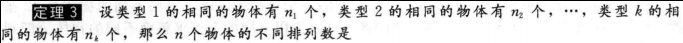

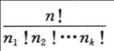

### 3.5.5 把物体放入盒子

#### 可辨别的物体与可辨别的盒子

#### 不可辨别的物体与可辨别的盒子

#### 可辨别的物体与不可辨别的盒子

#### 不可辨别的物体与不可辨别的盒子

# 第四章——高级计数技术

## 4.2 求解线性递推关系

### 4.2.1 引言

### 4.2.2 求解常系数线性齐次递推关系

#### 存在两个不等的特征根

#### 存在二重根或多重根

#### 一般性结果（不等根）

#### 最一般性结果（允许重根）

### 4.2.3 常系数线性非齐次的递推关系

#### 常系数线性非齐次定义

#### 解法

## 4.3 分治算法和递推关系

## 4.5 容斥

## 4.6 容斥原理的应用

### 4.6.2 容斥原理的另一种形式

### 4.6.4 映上函数的个数

### 4.6.5 错位排列

==n元素错位排列概率等于方式数除以n的排列数n!==

# 第五章——关系

## 5.1 关系及其性质

### 5.1.3 集合的关系

### 5.1.4 关系的性质

#### 自反

#### 对称和反对称

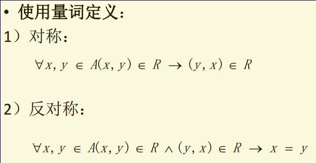

> 由上可知反对称成立条件：
>
> * 非对称
> * 对称病只有自反（只有(a, a)）

#### 传递性

### 5.1.5 关系的组合

#### 异或

即：

#### 关系的合成

#### 关系的幂

## 5.2 n元关系及其应用

## 5.3 关系的表示

### 5.3.2用矩阵表示关系

#### 自反、对称、反对称

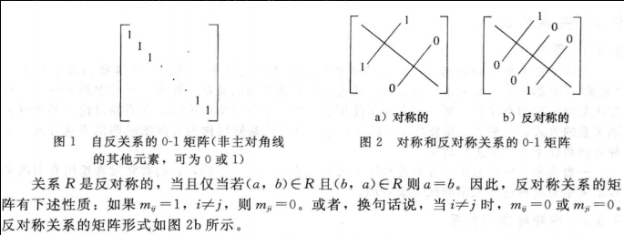

#### 两个关系之间的运算

### 5.3.3 用图表示关系

## 5.4 关系的闭包

#### 定义

#### 闭包的构造方法

#### 通过关系矩阵运算求关系的闭包

### 5.4.5沃舍尔Warshall算法

## 5.5 等价关系

### 等价关系

### 同余关系

### 等价类

### 商集

### 覆盖和划分

## 5.6 偏序

### 定义

### 良序、全序

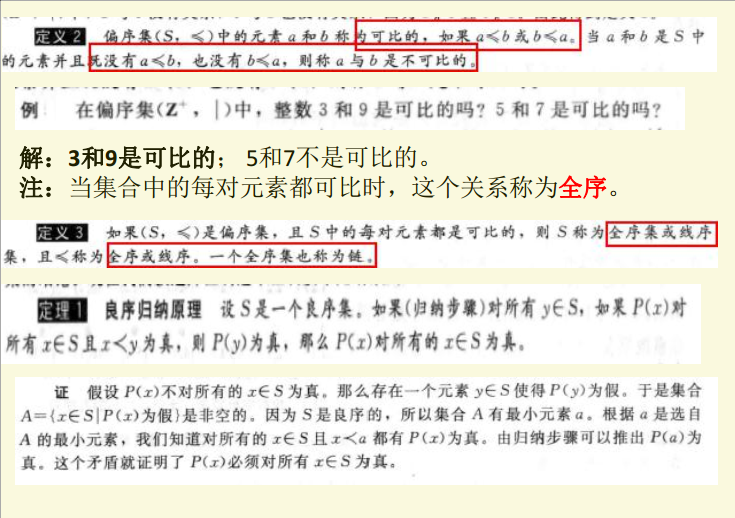

### 哈赛图

1. 移走环
2. 去掉由于传递性必须出现的边
3. 排列每条边使得起点在终点的下面

### 极大元、极小元、最大元、最小元

### 上界、下界、最小上界、最大下界

### 格

### 拓扑排序

# 第六章——图

## 6.1 图和图的模型

- 多重边：两个点之间有超过1条边连接。

## 6.2 图的术语和集中特殊的图

- **握手定理**

  

- **无向图有偶数个度为奇数的顶点**

- **二分图**

  

- **完全二分图**

  V1中的点要和V2中的所有点相连

## 6.3 图的表示和图的同构

### 表示
- #### **邻接矩阵**

- ####  **关联矩阵**

### **同构**

- 同构的简单图顶点、边、度要一样，点与点的相邻关系也要一样

- 利用通路和回路判断同构

  

  

## 6.4 连通性

### 连通分支

### 割点（关节点）

删除割点及其关联的边后，就产生比原图更多的连通分支。

### 点连通度

得到分割图所删除的最小顶点数

### 边连通度

得到分割图所删除的最小边数

### 有向图的连通性

#### 强连通

#### 弱连通

### 计算顶点之间的通路数

## 6.5 欧拉通路与哈密顿通路

### 欧拉回路

从起点出发，经过所有边（不重复），回到起点。

### 欧拉通路

从起点出发，经过所有边（不重复），不必回到起点。

### 欧拉回路和通路的判断

#### 欧拉回路

#### 欧拉通路

### 哈密顿回路

经过图G中每一个顶点恰好一次的简单回路成为哈密顿回路。

### 哈密顿通路

经过图G中每一个顶点恰好一次的简单通路成为哈密顿通路。

### 哈密顿回路通路判断

#### 狄拉克定理

#### 欧尔定理

## 6.6 最短通路问题

// TODO

## 6.7 平面图

## 6.8 图着色

- **n个顶点的完全图Kn的着色数为n**
- **完全二分图Km,n的着色数为2**
- **圈图Cn**
- 

## 术语和结论

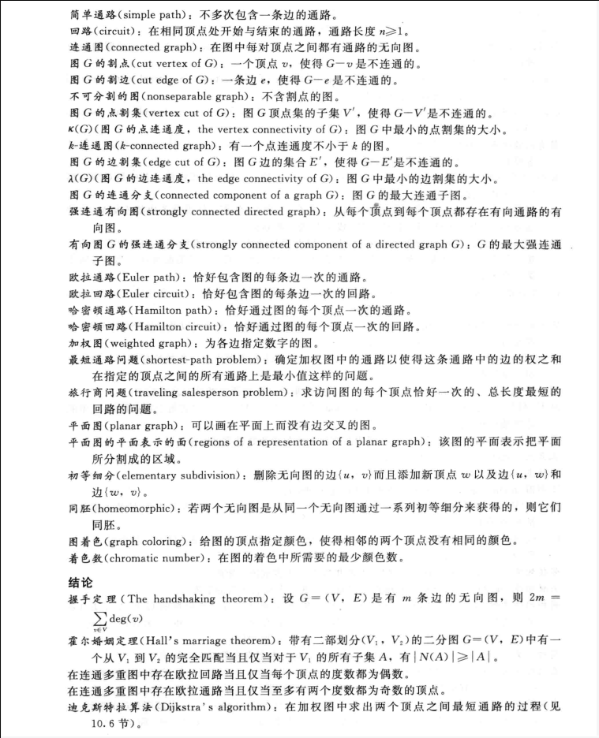

# 第七章——树

## 7.1 树的概述

### 引言

#### 定义

#### 有根树

### 树作为模型

### 树的性质

## 7.2 树的应用

### 二叉树搜索

#### 复杂度

### 决策树

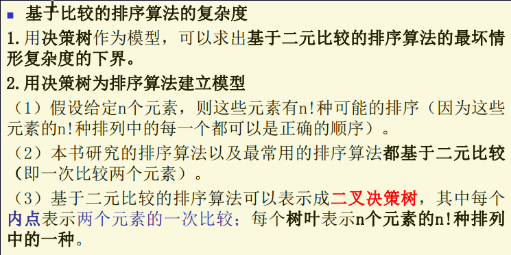

### 前缀码

### 博弈树

## 7.3 树的遍历

### 通用地址系统

### 遍历算法

### 中綴、前綴、后綴记法

#### 用有序树来表示复杂的表达式

#### 中綴形式

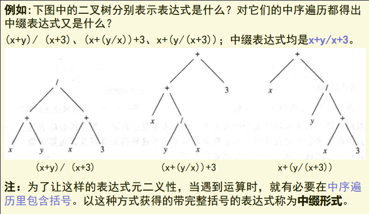

#### 前綴形式

==从右到左==

#### 后綴形式

==从左到右==

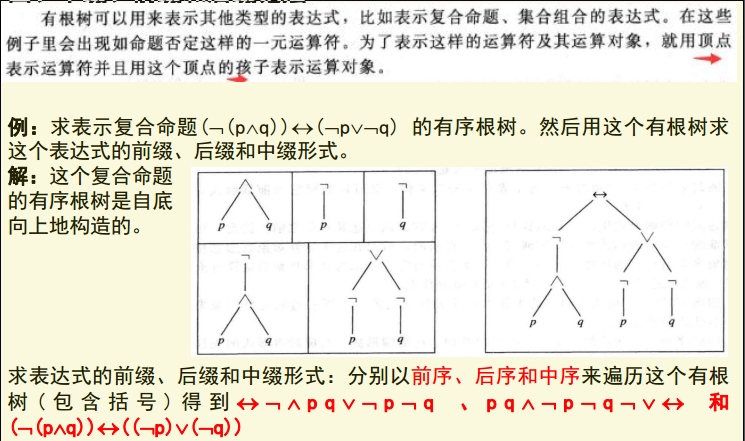

## 7.4 生成树

### 引言

### 深度优先搜索

#### 构造

#### 复杂度

### 宽度优先搜索

#### 构造

#### 复杂度

### 回溯的应用

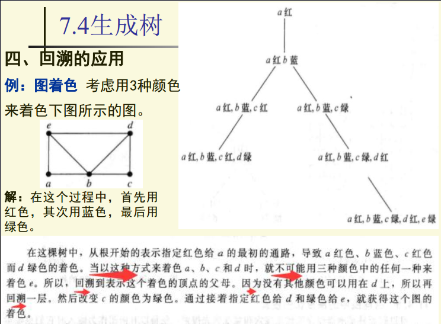

### 有向图中的深度优先搜索

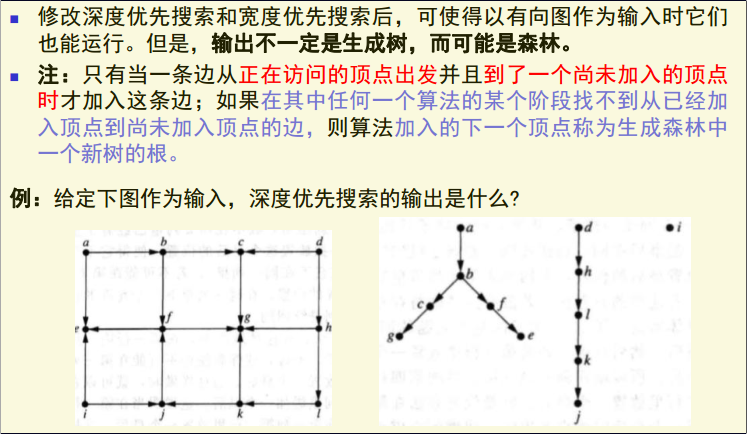

## 7.5 最小生成树

### 最小生成树算法

#### 普林(Prim)算法

#### 克鲁斯卡尔算法

#### 复杂度

### 

